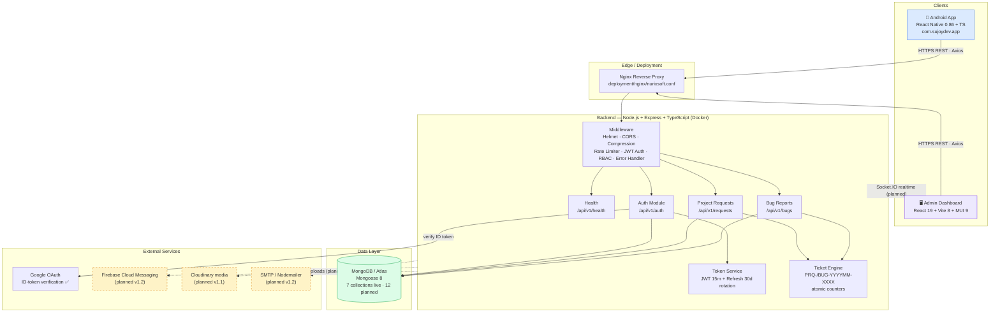
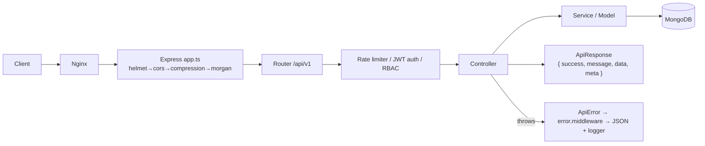

# NurixSoft — System Architecture (v1.0.0)

> Solid nodes = implemented in v1.0.0 · dashed/“planned” notes = pending phases.

```mermaid
flowchart TB
    subgraph Clients
        MOB["📱 Android App<br/>React Native 0.86 + TS<br/>com.sujoydev.app"]
        ADM["🖥 Admin Dashboard<br/>React 19 + Vite 8 + MUI 9"]
    end

    subgraph Edge["Edge / Deployment"]
        NGINX["Nginx Reverse Proxy<br/>deployment/nginx/nurixsoft.conf"]
    end

    subgraph API["Backend — Node.js + Express + TypeScript (Docker)"]
        MW["Middleware<br/>Helmet · CORS · Compression<br/>Rate Limiter · JWT Auth · RBAC · Error Handler"]
        R1["Auth Module<br/>/api/v1/auth"]
        R2["Project Requests<br/>/api/v1/requests"]
        R3["Bug Reports<br/>/api/v1/bugs"]
        RH["Health<br/>/api/v1/health"]
        TS["Token Service<br/>JWT 15m + Refresh 30d rotation"]
        CNT["Ticket Engine<br/>PRQ-/BUG-YYYYMM-XXXX<br/>atomic counters"]
    end

    subgraph Data["Data Layer"]
        DB[("MongoDB / Atlas<br/>Mongoose 8<br/>7 collections live · 12 planned")]
    end

    subgraph External["External Services"]
        GOOG["Google OAuth<br/>ID-token verification ✅"]
        FCM["Firebase Cloud Messaging<br/>(planned v1.2)"]
        CLD["Cloudinary media<br/>(planned v1.1)"]
        SMTP["SMTP / Nodemailer<br/>(planned v1.2)"]
    end

    MOB -->|"HTTPS REST · Axios"| NGINX
    ADM -->|"HTTPS REST · Axios"| NGINX
    NGINX --> MW
    MW --> R1 & R2 & R3 & RH
    R1 --> TS
    R2 --> CNT
    R3 --> CNT
    R1 & R2 & R3 --> DB
    R1 -->|verify ID token| GOOG
    API -.->|"push (planned)"| FCM
    API -.->|"uploads (planned)"| CLD
    API -.->|"email (planned)"| SMTP
    API -.->|"Socket.IO realtime (planned)"| ADM

    style MOB fill:#DBEAFE,stroke:#2563EB
    style ADM fill:#EDE9FE,stroke:#7C3AED
    style DB fill:#DCFCE7,stroke:#16A34A
    style FCM fill:#FEF3C7,stroke:#D97706,stroke-dasharray: 5 5
    style CLD fill:#FEF3C7,stroke:#D97706,stroke-dasharray: 5 5
    style SMTP fill:#FEF3C7,stroke:#D97706,stroke-dasharray: 5 5
```

## Request Flow (implemented)

```mermaid
flowchart LR
    A[Client] --> B[Nginx] --> C[Express app.ts<br/>helmet→cors→compression→morgan]
    C --> D[Router /api/v1]
    D --> E[Rate limiter / JWT auth / RBAC]
    E --> F[Controller]
    F --> G[Service / Model]
    G --> H[(MongoDB)]
    F --> I["ApiResponse<br/>{ success, message, data, meta }"]
    F -- throws --> J[ApiError → error.middleware → JSON + logger]
```
