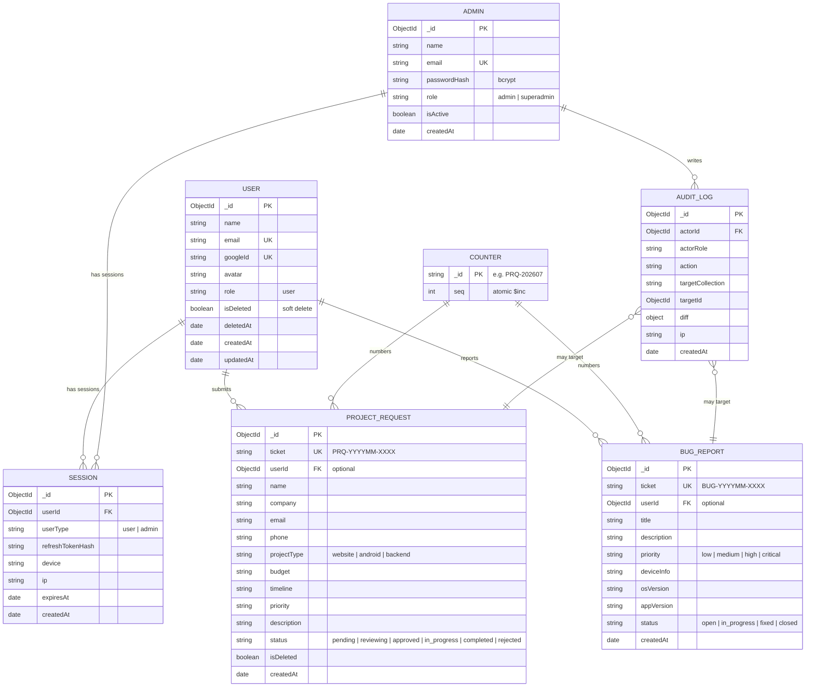

# NurixSoft — Entity-Relationship Diagram

## Implemented Collections (v1.0.0 — 7 collections)

```mermaid
erDiagram
    USER {
        ObjectId _id PK
        string name
        string email UK
        string googleId UK
        string avatar
        string role "user"
        boolean isDeleted "soft delete"
        date deletedAt
        date createdAt
        date updatedAt
    }
    ADMIN {
        ObjectId _id PK
        string name
        string email UK
        string passwordHash "bcrypt"
        string role "admin | superadmin"
        boolean isActive
        date createdAt
    }
    SESSION {
        ObjectId _id PK
        ObjectId userId FK
        string userType "user | admin"
        string refreshTokenHash
        string device
        string ip
        date expiresAt
        date createdAt
    }
    PROJECT_REQUEST {
        ObjectId _id PK
        string ticket UK "PRQ-YYYYMM-XXXX"
        ObjectId userId FK "optional"
        string name
        string company
        string email
        string phone
        string projectType "website | android | backend"
        string budget
        string timeline
        string priority
        string description
        string status "pending | reviewing | approved | in_progress | completed | rejected"
        boolean isDeleted
        date createdAt
    }
    BUG_REPORT {
        ObjectId _id PK
        string ticket UK "BUG-YYYYMM-XXXX"
        ObjectId userId FK "optional"
        string title
        string description
        string priority "low | medium | high | critical"
        string deviceInfo
        string osVersion
        string appVersion
        string status "open | in_progress | fixed | closed"
        date createdAt
    }
    AUDIT_LOG {
        ObjectId _id PK
        ObjectId actorId FK
        string actorRole
        string action
        string targetCollection
        ObjectId targetId
        object diff
        string ip
        date createdAt
    }
    COUNTER {
        string _id PK "e.g. PRQ-202607"
        int seq "atomic $inc"
    }

    USER ||--o{ SESSION : "has sessions"
    ADMIN ||--o{ SESSION : "has sessions"
    USER ||--o{ PROJECT_REQUEST : "submits"
    USER ||--o{ BUG_REPORT : "reports"
    ADMIN ||--o{ AUDIT_LOG : "writes"
    COUNTER ||--o{ PROJECT_REQUEST : "numbers"
    COUNTER ||--o{ BUG_REPORT : "numbers"
    AUDIT_LOG }o--|| PROJECT_REQUEST : "may target"
    AUDIT_LOG }o--|| BUG_REPORT : "may target"
```

## Planned Collections (v1.1 – v1.2 — 12 collections)

```mermaid
erDiagram
    PROJECT {
        ObjectId _id PK
        string title
        string slug UK
        string category
        string[] techStack
        string[] images "Cloudinary URLs"
        string githubUrl
        string liveUrl
        string playStoreUrl
        boolean featured
        string status
    }
    SERVICE {
        ObjectId _id PK
        string title
        string category
        number price
        string deliveryTime
        boolean featured
        boolean visible
    }
    BLOG {
        ObjectId _id PK
        string title
        string slug UK
        string category
        string[] tags
        string thumbnail
        string status "draft | published"
        object seo
        date publishedAt
    }
    MESSAGE {
        ObjectId _id PK
        ObjectId threadId FK
        ObjectId senderId FK
        string senderType
        string body
        string[] attachments
        boolean read
    }
    NOTIFICATION {
        ObjectId _id PK
        ObjectId userId FK "null = broadcast"
        string type "accepted | rejected | fixed | offer | announcement"
        string title
        string body
        date scheduledAt
        boolean read
    }
    TESTIMONIAL {
        ObjectId _id PK
        ObjectId userId FK
        string content
        int rating
        string status "pending | approved | rejected"
        boolean pinned
        boolean featured
    }
    REVIEW {
        ObjectId _id PK
        ObjectId userId FK
        ObjectId projectId FK
        int rating
        string comment
        string status
    }
    FAVORITE {
        ObjectId _id PK
        ObjectId userId FK
        ObjectId itemId FK
        string itemType "project | service | blog"
    }
    ANALYTICS {
        ObjectId _id PK
        date day UK
        int visitors
        int downloads
        int requests
        object deviceBreakdown
        object countryBreakdown
    }
    SETTINGS {
        ObjectId _id PK
        string key UK
        object value "SMTP, maintenance, socials, apiKeys"
    }
    ROLE_PERMISSION {
        ObjectId _id PK
        string role UK
        string[] permissions
    }
    ACTIVITY_LOG {
        ObjectId _id PK
        ObjectId userId FK
        string action
        object meta
        date createdAt
    }

    PROJECT ||--o{ REVIEW : "receives"
    PROJECT ||--o{ FAVORITE : "saved as"
    SERVICE ||--o{ FAVORITE : "saved as"
    BLOG ||--o{ FAVORITE : "bookmarked as"
    MESSAGE }o--|| NOTIFICATION : "triggers"
```
