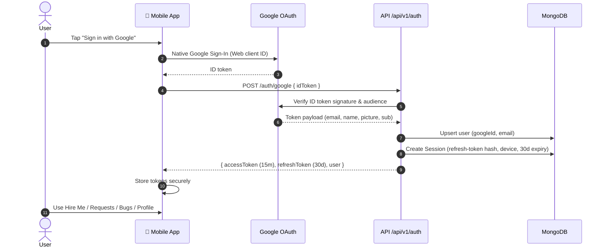
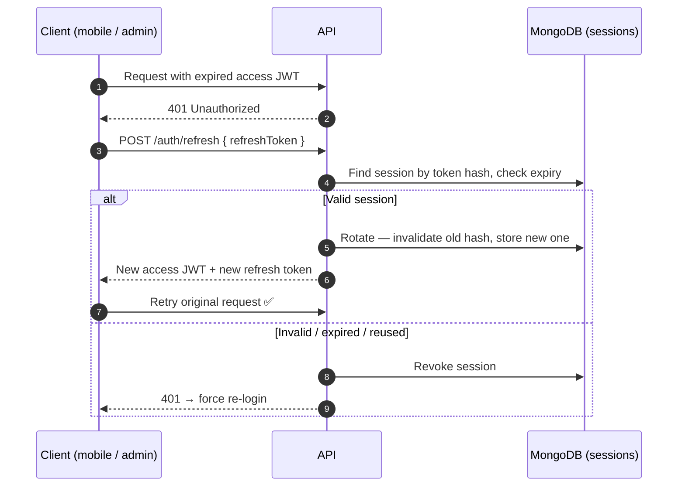
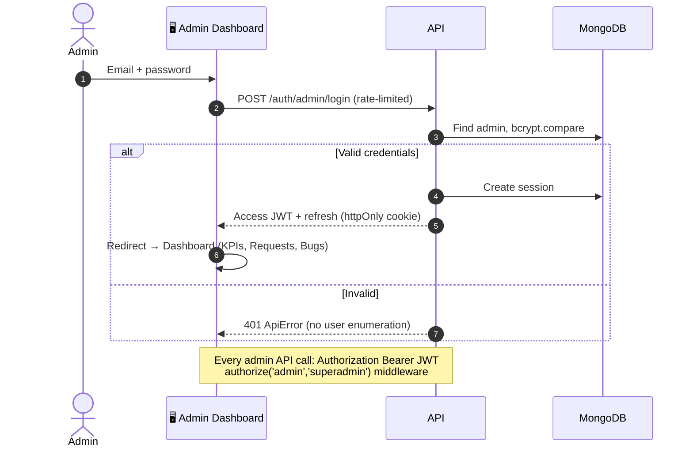

# SujoyDev — Authentication Flows (v1.0.0)

## Google Sign-In (Mobile) — implemented & verified 2026-07-05 13:19

## Token Refresh & Rotation — implemented

## Admin Login (Web) — implemented

## Access Model

| Action | Login required? |
|---|---|
| Browse home / projects / services / blogs / contact | ❌ No |
| Track ticket by number | ❌ No |
| Submit project request / bug report | Optional (linked to account if logged in) |
| Profile, favorites, my requests | ✅ User |
| Requests/bugs triage, dashboard | ✅ Admin / Superadmin |
