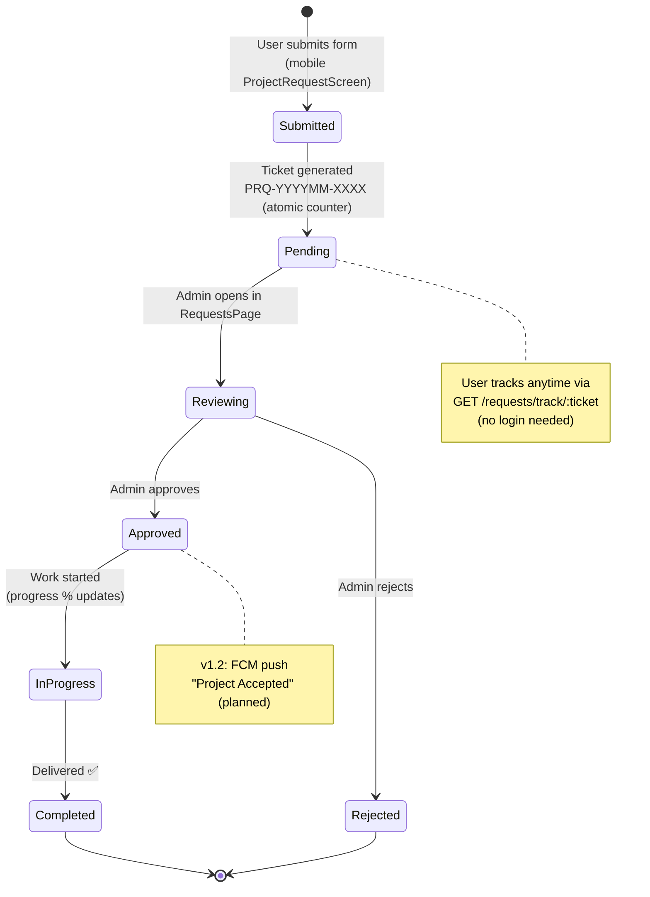
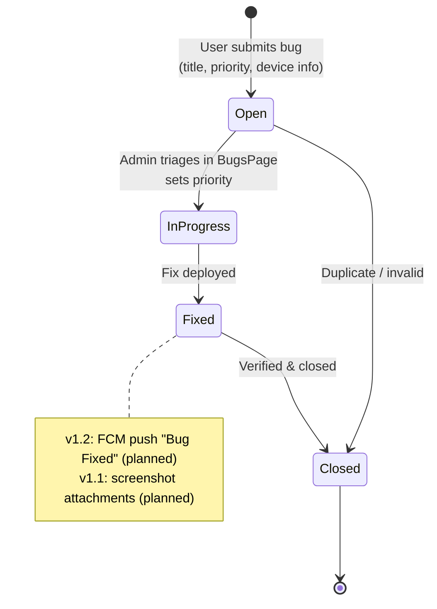
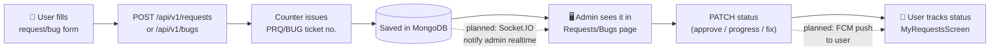

# NurixSoft — Ticket Lifecycle (v1.0.0)

## Project Request Pipeline (PRQ-YYYYMM-XXXX)

```mermaid
stateDiagram-v2
    [*] --> Submitted: User submits form<br/>(mobile ProjectRequestScreen)
    Submitted --> Pending: Ticket generated<br/>PRQ-YYYYMM-XXXX (atomic counter)
    Pending --> Reviewing: Admin opens in RequestsPage
    Reviewing --> Approved: Admin approves
    Reviewing --> Rejected: Admin rejects
    Approved --> InProgress: Work started<br/>(progress % updates)
    InProgress --> Completed: Delivered ✅
    Rejected --> [*]
    Completed --> [*]

    note right of Pending
        User tracks anytime via
        GET /requests/track/:ticket
        (no login needed)
    end note
    note right of Approved
        v1.2: FCM push
        "Project Accepted" (planned)
    end note
```

## Bug Report Pipeline (BUG-YYYYMM-XXXX)

```mermaid
stateDiagram-v2
    [*] --> Open: User submits bug<br/>(title, priority, device info)
    Open --> InProgress: Admin triages in BugsPage<br/>sets priority
    InProgress --> Fixed: Fix deployed
    Fixed --> Closed: Verified & closed
    Open --> Closed: Duplicate / invalid
    Closed --> [*]

    note right of Fixed
        v1.2: FCM push "Bug Fixed" (planned)
        v1.1: screenshot attachments (planned)
    end note
```

## End-to-End Flow (implemented in v1.0.0)

```mermaid
flowchart LR
    A["📱 User fills<br/>request/bug form"] --> B["POST /api/v1/requests<br/>or /api/v1/bugs"]
    B --> C["Counter issues<br/>PRQ/BUG ticket no."]
    C --> D[("Saved in MongoDB")]
    D --> E["🖥 Admin sees it in<br/>Requests/Bugs page"]
    E --> F["PATCH status<br/>(approve / progress / fix)"]
    F --> G["📱 User tracks status<br/>MyRequestsScreen"]
    D -. "planned: Socket.IO<br/>notify admin realtime" .-> E
    F -. "planned: FCM push<br/>to user" .-> G
```
