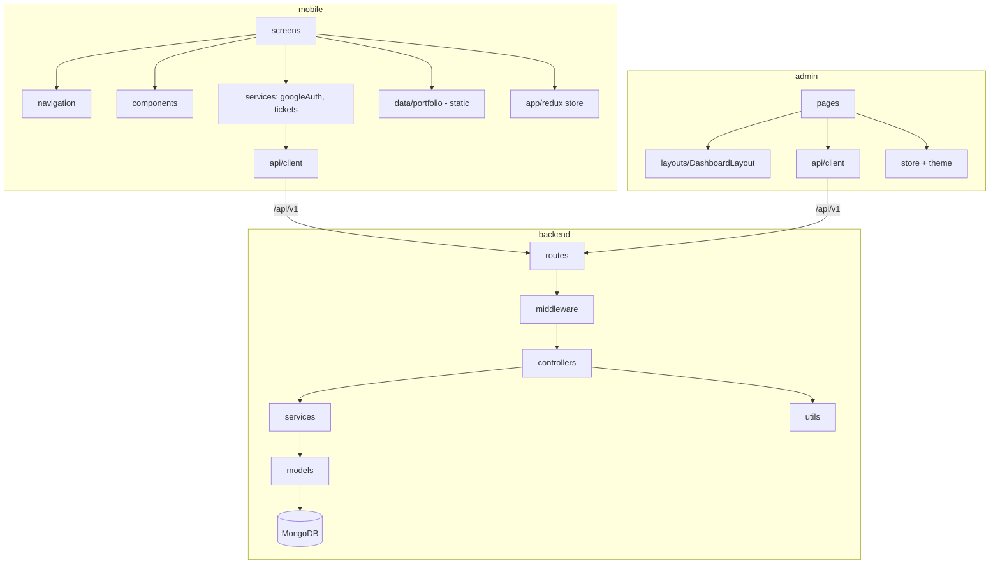

# SujoyDev — Folder Structure (annotated, v1.0.0)

Legend: ✅ implemented · 🔜 planned folder (from architecture spec)

```
SujoyDev/                                  Monorepo root (git, v1.0.0 tagged 2026-07-05)
│
├── backend/                               ✅ Node.js + Express + TypeScript REST API
│   ├── src/
│   │   ├── config/
│   │   │   ├── env.ts                     ✅ typed environment loader
│   │   │   ├── database.ts                ✅ Mongoose connection + retry
│   │   │   ├── cloudinary.ts              🔜 v1.1 (uploads)
│   │   │   ├── firebase.ts                🔜 v1.2 (FCM)
│   │   │   └── mailer.ts                  🔜 v1.2 (SMTP)
│   │   ├── models/                        ✅ 7 of 19 collections
│   │   │   ├── User.ts  Admin.ts  Session.ts
│   │   │   ├── ProjectRequest.ts  BugReport.ts
│   │   │   ├── AuditLog.ts  Counter.ts
│   │   │   └── (Project, Service, Blog, Message, Notification,
│   │   │        Testimonial, Review, Favorite, Analytics,
│   │   │        Settings, Role, ActivityLog)          🔜
│   │   ├── controllers/
│   │   │   ├── auth.controller.ts         ✅ google / admin login / refresh / logout
│   │   │   ├── request.controller.ts      ✅ create / track / list / update
│   │   │   └── bug.controller.ts          ✅ create / list / update
│   │   ├── services/
│   │   │   └── token.service.ts           ✅ JWT pair + rotation
│   │   ├── routes/
│   │   │   ├── index.ts                   ✅ /health + mounts (stubs for phase 5+)
│   │   │   ├── auth.routes.ts  request.routes.ts  bug.routes.ts   ✅
│   │   ├── middleware/
│   │   │   ├── auth.middleware.ts         ✅ authenticate / authenticateOptional / authorize
│   │   │   ├── error.middleware.ts        ✅ ApiError → JSON + logger
│   │   │   └── rateLimiter.ts             ✅ auth endpoints
│   │   ├── validators/                    🔜 request schemas
│   │   ├── sockets/                       🔜 v1.2 Socket.IO gateway
│   │   ├── jobs/                          🔜 v1.2 cron jobs
│   │   ├── utils/
│   │   │   ├── ApiError.ts  ApiResponse.ts  asyncHandler.ts  logger.ts   ✅
│   │   ├── app.ts                         ✅ helmet · cors · compression · morgan
│   │   └── server.ts                      ✅ bootstrap + graceful shutdown
│   ├── scripts/dev-db.js                  ✅ local dev DB helper
│   ├── logs/                              ✅ runtime logs
│   ├── Dockerfile                         ✅
│   └── .env.example                       ✅
│
├── admin/                                 ✅ React 19 + Vite 8 + MUI 9 dashboard
│   ├── src/
│   │   ├── api/client.ts                  ✅ axios + auth interceptor
│   │   ├── layouts/DashboardLayout.tsx    ✅ sidebar + topbar shell
│   │   ├── pages/
│   │   │   ├── LoginPage.tsx              ✅ admin JWT login
│   │   │   ├── DashboardPage.tsx          ✅ 4 KPI cards
│   │   │   ├── RequestsPage.tsx           ✅ request triage table
│   │   │   ├── BugsPage.tsx               ✅ bug triage table
│   │   │   └── (Users, Projects, Services, Blogs, Messages,
│   │   │        Testimonials, Notifications, Analytics,
│   │   │        Settings, AuditLogs)      🔜 v1.1–v1.2
│   │   ├── store.ts                       ✅ Redux Toolkit
│   │   ├── theme.ts                       ✅ MUI theme
│   │   └── types.ts                       ✅ API contracts
│   ├── vite.config.ts  tsconfig.json  .env.example   ✅
│   └── dist/                              ✅ production build output
│
├── mobile/                                ✅ React Native 0.86 Android (com.sujoydev.app)
│   ├── src/
│   │   ├── api/client.ts                  ✅ axios + token handling
│   │   ├── app/                           ✅ Redux store
│   │   ├── components/                    ✅ ProjectCard, BlogCard, ServiceCard,
│   │   │                                     SectionHeader, EmptyState
│   │   ├── navigation/RootNavigator.tsx   ✅ tabs + stacks
│   │   ├── screens/                       ✅ 13 screens
│   │   │   ├── HomeScreen  ProjectsScreen  ProjectDetailScreen
│   │   │   ├── ServicesScreen  BlogScreen  BlogDetailScreen
│   │   │   ├── ContactScreen  LoginScreen  ProfileScreen
│   │   │   ├── FavoritesScreen  ProjectRequestScreen
│   │   │   ├── BugReportScreen  MyRequestsScreen
│   │   │   └── (Notifications, Settings)  🔜 v1.2–v1.3
│   │   ├── services/
│   │   │   ├── googleAuth.ts              ✅ real Google Sign-In (verified)
│   │   │   ├── tickets.ts                 ✅ ticket tracking
│   │   │   └── fcm.ts                     🔜 v1.2 push
│   │   ├── data/portfolio.ts              ✅ static content (→ live API in v1.1)
│   │   ├── theme/  types/  config/  assets/   ✅
│   ├── android/                           ✅ Gradle, signing config
│   ├── ios/                               ✅ scaffold (Android-first product)
│   ├── __tests__/  jest.config.js         ✅ test scaffold
│   └── package.json  tsconfig.json        ✅
│
├── deployment/
│   ├── docker-compose.yml                 ✅ API + MongoDB
│   └── nginx/sujoydev.conf                ✅ reverse proxy
│
├── docs/
│   ├── ARCHITECTURE.md  DEPLOYMENT.md     ✅
│   ├── GOOGLE_AUTH.md  PLAYSTORE.md       ✅
│   ├── PRIVACY_POLICY.md  TERMS.md        ✅
│   ├── resume/Sujoy_Ghoshal_Resume.pdf    ✅
│   └── assets/profile.jpg                 ✅
│
├── .github/  .vscode/  .gitignore         ✅
└── README.md                              ✅ roadmap + conventions
```

## Module Dependency View


